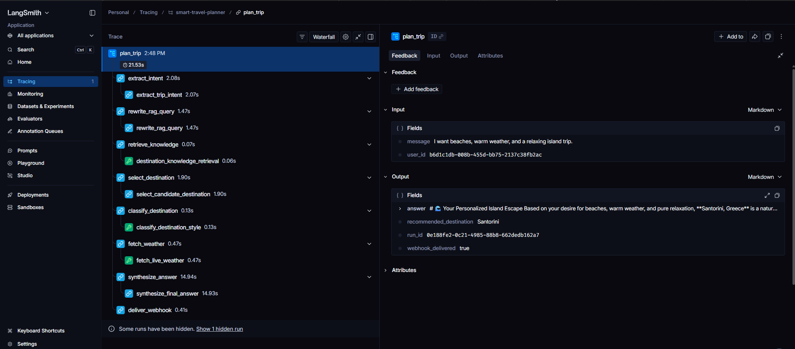

# Smart Travel Planner


Smart Travel Planner is a full-stack AI travel planning system. A user signs in, asks for a trip recommendation in natural language, and the backend runs a controlled LangGraph agent that combines destination knowledge from RAG, a trained scikit-learn destination-style classifier, live weather, two Anthropic models, persistent trace logs, and Discord webhook delivery.

The goal is not just to generate a travel answer. The goal is to build the surrounding AI system like production software: async FastAPI, dependency injection, lifespan-managed singletons, Pydantic validation, SQLAlchemy persistence, pgvector retrieval, structured logs, tests, Docker, and a React frontend.

---

## What the System Does

Example user prompt:

```text
I have two weeks off in July and around $1,500. I want somewhere warm, not too touristy, and I like hiking. Where should I go?
```

The system:

1. Authenticates the user through Supabase.
2. Creates an `AgentRun` scoped to that user.
3. Uses Haiku to extract intent and rewrite the RAG query.
4. Searches destination knowledge stored in Postgres + pgvector.
5. Uses Haiku to choose a supported candidate destination.
6. Uses a trained scikit-learn classifier to classify the destination’s travel style.
7. Fetches live weather for the selected destination.
8. Uses Sonnet to synthesize a final travel plan.
9. Sends the plan to Discord through a webhook.
10. Stores tool calls, LLM usage, costs, and trace events.
11. Returns the final answer to the React frontend.
12. Lets the user inspect what the agent did through trace routes and the UI trace panel.

---

## Demo Evidence

### Demo video


```text
Demo video: Work in progess
```

## Quick Start — Docker

Prerequisites:

- Docker Desktop
- A Supabase project for auth
- Anthropic API key
- Discord webhook URL
- LangSmith API key if you want external traces

### 1. Configure environment

Copy the example env file:

```bash
cp .env.example .env
```

If using split env files:

```bash
cp backend/.env.example backend/.env
cp frontend/.env.example frontend/.env
```

The Docker Compose setup can read both root and service-specific env files. Never commit real `.env` files.

### 2. Start the full stack

```bash
docker compose up --build
```

This starts:

- Postgres + pgvector
- FastAPI backend at `http://localhost:8000`
- React frontend at `http://localhost:5173`

The backend startup runs Alembic migrations automatically if configured by the Docker entrypoint.

### 3. Ingest RAG data into local Docker Postgres

For a fresh Docker database, run:

```bash
docker compose exec backend uv run python scripts/ingest_rag_documents.py
```

Verify data exists:

```bash
docker compose exec db psql -U postgres -d smart_travel -c "select count(*) from destination_documents;"
docker compose exec db psql -U postgres -d smart_travel -c "select count(*) from destination_chunks;"
```

Expected:

```text
destination_documents: 20
destination_chunks: > 0
```

### 4. Open the app

- Frontend: http://localhost:5173
- Backend Swagger: http://localhost:8000/docs

---

## Quick Start — Local Development

### Backend

```bash
cd backend
uv sync
uv run alembic upgrade head
uv run uvicorn app.main:app --reload
```

### RAG ingestion

```bash
cd backend
uv run python scripts/ingest_rag_documents.py
```

### Frontend

```bash
cd frontend
npm install
npm run dev
```

Open:

```text
http://localhost:5173
```

---

## Environment Variables

The project uses `pydantic-settings` for typed configuration. Unknown keys are rejected, so typos fail early instead of causing runtime surprises.

### Backend variables

| Variable | Purpose | Required |
|---|---|---|
| `DATABASE_URL` | Async SQLAlchemy URL for Postgres | Yes |
| `SUPABASE_JWT_JWKS_URL` | Supabase JWKS endpoint for JWT verification | Yes |
| `SUPABASE_JWT_ISSUER` | Supabase auth issuer | Yes |
| `SUPABASE_JWT_AUDIENCE` | Expected JWT audience | Yes |
| `SUPABASE_ANON_KEY` | Supabase anon key | Yes |
| `SUPABASE_SERVICE_ROLE_KEY` | Backend-only Supabase service key | Yes |
| `ANTHROPIC_API_KEY` | Anthropic API key | Yes |
| `WEBHOOK_URL` | Discord webhook URL | Yes |
| `WEATHER_API_URL` | Open-Meteo endpoint | No |
| `LOG_LEVEL` | App log level | No |
| `HAIKU_MODEL` | Cheap model for mechanical work | No |
| `SONNET_MODEL` | Strong model for synthesis | No |
| `EMBEDDING_MODEL` | SentenceTransformer model name | No |
| `LANGCHAIN_TRACING_V2` | Enables LangSmith tracing | No |
| `LANGCHAIN_API_KEY` | LangSmith API key | No |
| `LANGCHAIN_PROJECT` | LangSmith project name | No |
| `MAX_AGENT_STEPS` | Agent runtime guard | No |
| `TOOL_ARG_REPAIR_ATTEMPTS` | Tool argument repair attempts | No |
| `ANTHROPIC_TIMEOUT_SECONDS` | Anthropic call timeout | No |
| `CORS_ORIGINS` | Allowed frontend origins | No |

### Frontend variables

| Variable | Purpose | Required |
|---|---|---|
| `VITE_API_BASE_URL` | Backend API URL | Yes |
| `VITE_SUPABASE_URL` | Supabase project URL | Yes |
| `VITE_SUPABASE_ANON_KEY` | Supabase anon key for browser auth | Yes |

Only `VITE_` variables are exposed to the browser. Never expose `SUPABASE_SERVICE_ROLE_KEY` in frontend code.

---

## Architecture

```text
┌─────────────────────────────────────────────────────────────────────┐
│                           React Frontend                            │
│                                                                     │
│  Vite + React                                                       │
│  - Supabase sign-up/login                                           │
│  - Chat-style trip planner                                          │
│  - Recent runs sidebar                                              │
│  - Trace/debug panel                                                │
└───────────────────────────────┬─────────────────────────────────────┘
                                │ Bearer Supabase JWT
                                ▼
┌─────────────────────────────────────────────────────────────────────┐
│                          FastAPI Backend                            │
│                                                                     │
│  Routers                                                            │
│  - /chat/plan-trip                                                  │
│  - /traces                                                          │
│  - /rag/search + /rag/eval                                          │
│  - /classifier/predict                                              │
│  - /weather/forecast                                                │
│  - /webhook/test-discord                                            │
│                                                                     │
│  Lifespan Singletons                                                │
│  - DB engine/session factory                                        │
│  - SentenceTransformer embedder                                     │
│  - joblib classifier pipeline                                       │
│  - WeatherService httpx client + cache                              │
│  - WebhookService httpx client                                      │
│  - ModelRouter with Anthropic async client                          │
└───────────────────────────────┬─────────────────────────────────────┘
                                │
                                ▼
┌─────────────────────────────────────────────────────────────────────┐
│                       Controlled LangGraph Agent                     │
│                                                                     │
│  extract_intent        → Haiku                                      │
│  rewrite_rag_query     → Haiku                                      │
│  retrieve_knowledge    → RAG tool                                   │
│  select_destination    → Haiku                                      │
│  classify_destination  → ML classifier tool                         │
│  fetch_weather         → Open-Meteo tool                            │
│  synthesize_answer     → Sonnet                                     │
│  deliver_webhook       → Discord webhook                            │
└───────────────────────────────┬─────────────────────────────────────┘
                                │
                ┌───────────────┼────────────────┐
                ▼               ▼                ▼
┌──────────────────────┐ ┌────────────────┐ ┌─────────────────────────┐
│ Postgres + pgvector  │ │ Supabase Auth  │ │ External APIs            │
│ - RAG documents      │ │ - email login  │ │ - Anthropic              │
│ - vector chunks      │ │ - JWT          │ │ - Open-Meteo             │
│ - agent runs         │ └────────────────┘ │ - Discord webhook        │
│ - tool logs          │                    │ - LangSmith tracing      │
│ - LLM usage          │                    └─────────────────────────┘
│ - trace events       │
└──────────────────────┘
```

---

## End-to-End Data Flow

```text
User logs in
    ↓
React gets Supabase access_token
    ↓
POST /chat/plan-trip
    ↓
FastAPI validates JWT and request body
    ↓
AgentService creates AgentRun
    ↓
LangGraph controlled graph starts
    ↓
Haiku extracts intent
    ↓
Haiku rewrites RAG query
    ↓
RAG tool retrieves pgvector destination chunks
    ↓
Haiku selects a supported destination
    ↓
Classifier tool predicts travel style
    ↓
Weather tool fetches live forecast
    ↓
Sonnet synthesizes final answer
    ↓
Discord webhook receives the trip plan
    ↓
AgentRun marked completed
    ↓
React displays answer + trace panel
```

---

## Tech Stack

| Layer | Technology |
|---|---|
| Backend | FastAPI, Python 3.12, uv |
| Frontend | Vite, React, TypeScript |
| Agent orchestration | LangGraph controlled `StateGraph` |
| LLMs | Anthropic Haiku + Sonnet |
| RAG embeddings | `sentence-transformers/all-MiniLM-L6-v2` |
| Vector database | PostgreSQL + pgvector |
| ORM/migrations | SQLAlchemy async + Alembic |
| ML | scikit-learn Pipeline, joblib |
| Auth | Supabase email/password + JWT |
| Weather API | Open-Meteo |
| Webhook | Discord webhook |
| Tracing | LangSmith + local DB trace routes |
| Testing | pytest, pytest-asyncio, mypy, ruff |
| Containers | Docker Compose |

---

## API Overview

| Method | Path | Purpose |
|---|---|---|
| `GET` | `/healthz` | Backend + DB health check |
| `POST` | `/chat/plan-trip` | Runs the full LangGraph travel agent |
| `GET` | `/traces` | Lists current user’s recent agent runs |
| `GET` | `/traces/{run_id}` | Shows tool calls, LLM usage, and trace events for one run |
| `POST` | `/rag/search` | Manual RAG search endpoint |
| `GET` | `/rag/eval` | Fixed retrieval evaluation cases |
| `POST` | `/classifier/predict` | Direct classifier prediction endpoint |
| `POST` | `/weather/forecast` | Direct weather endpoint |
| `POST` | `/webhook/test-discord` | Sends a test Discord webhook |

---

## Machine Learning Classifier

### Goal

Train a classifier that predicts a destination’s travel style:

```text
Adventure, Relaxation, Culture, Budget, Luxury, Family
```

The classifier is used as one of the agent’s three tools. It gives the agent a structured signal about the selected destination.

### Dataset

The dataset was compiled from a raw destination dataset and transformed into a processed dataset with a rule-based travel-style label.

Folders:

```text
backend/ml/data/raw/
backend/ml/data/processed/
```

The processed dataset is used by:

```text
backend/ml/train_classifier.py
```

### Features

The model uses eight structured destination features:

| Feature | Reason |
|---|---|
| `country` | Location context |
| `continent` | Regional travel pattern |
| `destination_type` | Strong signal for travel style |
| `avg_cost_usd_per_day` | Helps identify Budget/Luxury |
| `best_season` | Seasonal travel context |
| `avg_rating` | Proxy for popularity/quality |
| `annual_visitors_m` | Helps identify tourist intensity |
| `unesco_site` | Strong signal for Culture |

### Labeling rules

Labels were created using a role-scoring rule rather than arbitrary manual guessing.

| Travel style | Labeling signal |
|---|---|
| `Adventure` | Outdoor/adventure destination types, hiking/nature signals |
| `Relaxation` | Beaches, islands, wellness, slow-travel destinations |
| `Culture` | UNESCO/cultural/historical destinations |
| `Budget` | Lower average daily cost and affordable travel profile |
| `Luxury` | High daily cost, premium destination types, high-end travel profile |
| `Family` | Safe, accessible, simple-to-navigate destinations |

The labeling rule is documented in the ML README and implemented in the training/preparation workflow.

### Pipeline design

The winner is saved as a joblib artifact and loaded once in FastAPI lifespan.

Key engineering decisions:

- scikit-learn `Pipeline` is used.
- preprocessing lives inside the pipeline to prevent leakage.
- categorical features are encoded inside the pipeline.
- random seeds are fixed for reproducibility.
- model artifacts and metadata are saved for backend inference.
- the backend never retrains during a request.


---

## RAG System

### Goal

Build a retrieval tool over real destination content.

Requirements satisfied:

- 10 destinations
- 20 documents
- real destination content from Wikivoyage
- embeddings stored in Postgres via pgvector
- same database as agent runs and logs
- retrieval tested before agent integration

### Destinations

```text
Bali
Banff
Dubai
Interlaken
Istanbul
Kyoto
Kraków
Santorini
Singapore
Tbilisi
```

### Corpus collection

Destination documents are saved into:

```text
backend/rag_data/raw/
```

Each file uses this header format:

```text
destination:
source_title:
source_url:
---
real travel text
```

There are two files per destination:

```text
<destination>_overview.txt
<destination>_details.txt
```


## LangGraph Agent


#### LangSmith multi-tool trace

> Required by the brief. Capture one full `/chat/plan-trip` run showing the graph/tool execution.

```md

```

### Design choice: controlled graph, not ReAct

The agent uses LangGraph, but it is not a free-form ReAct agent.

In a ReAct loop, the LLM decides which tool to call and when. This project uses a controlled `StateGraph`: each node is explicit and each edge is hardcoded.

### Node order

```text
START
  → extract_intent          (Haiku)
  → rewrite_rag_query       (Haiku)
  → retrieve_knowledge      (RAG tool)
  → select_destination      (Haiku)
  → classify_destination    (ML classifier tool)
  → fetch_weather           (Weather tool)
  → synthesize_answer       (Sonnet)
  → deliver_webhook         (Discord)
  → END
```

### The three tools

| Tool | Input schema | What it does |
|---|---|---|
| `destination_knowledge_retrieval` | `DestinationKnowledgeInput` | Retrieves relevant pgvector chunks |
| `classify_destination_style` | `ClassifyDestinationInput` | Predicts travel style using the ML model |
| `fetch_live_weather` | `LiveWeatherInput` | Gets live forecast from Open-Meteo |

### Tool safety

All tool inputs are validated with Pydantic before the tool runs.

The agent has an explicit allowlist:

```text
destination_knowledge_retrieval
classify_destination_style
fetch_live_weather
```

The LLM never names arbitrary tools. Tool calls are hardcoded graph nodes, which prevents tool invention.

### Synthesis behavior

The Sonnet synthesis prompt receives the user query, extracted intent, retrieved RAG evidence, classifier output, live weather output, and tool errors if any.

Example behavior:

```text
RAG says Santorini is a warm beach/hiking option, but the live weather forecast shows cooler-than-expected temperatures. The final answer explains that tension and recommends timing the trip for warmer months.
```

---

## Persistence and Traceability

The system uses one Postgres database for:

- destination documents,
- pgvector chunks,
- user-scoped agent runs,
- tool-call logs,
- LLM usage logs,
- trace events.

### Tables

| Table | Purpose |
|---|---|
| `destination_documents` | RAG source documents |
| `destination_chunks` | Embedded chunks with pgvector |
| `agent_runs` | One row per user query |
| `tool_call_logs` | Tool invocations and summaries |
| `llm_usage_logs` | Token counts, model names, estimated costs |
| `agent_trace_events` | Timeline events for debugging |
| `runs` | Earlier/simple run table kept for compatibility |

### Trace inspection routes

| Method | Path | Purpose |
|---|---|---|
| `GET` | `/traces` | Lists current user’s recent runs |
| `GET` | `/traces/{run_id}` | Shows tools, LLM usage, and trace events |

---

## Authentication

The app uses Supabase email/password authentication.

Frontend flow:

```text
sign up / login → Supabase session → access_token
```

Backend flow:

```text
Authorization: Bearer <access_token>
    ↓
JWT verification
    ↓
CurrentUser(user_id, email)
    ↓
AgentRun scoped to current_user.user_id
```

Every protected route uses the current user dependency, and trace inspection only returns runs belonging to the logged-in user.

---

## React Frontend

The frontend is a Vite + React + TypeScript app.

Features:

- sign up,
- login,
- logout,
- persisted Supabase session,
- chat-style trip question input,
- final answer panel,
- recommended destination display,
- Discord delivery status,
- recent run history,
- trace/debug panel showing:
  - tool calls,
  - LLM usage,
  - trace timeline.

---

## Webhook Delivery

When the agent completes, the backend sends the final plan to Discord.

Important behavior:

- webhook is async,
- webhook has timeout and retry,
- webhook failure does not break the user-facing response,
- Discord receives only user-facing content,
- internal token costs/tool logs are not sent to Discord.

Discord has a 2,000 character message limit, so long plans may be truncated with a clear `[truncated]` marker.

---

## Project Structure

Check structure.md file

---

## Engineering Decisions

### Why Postgres + pgvector?

The brief requires embeddings in Postgres via pgvector. This also keeps destination documents, chunks, user runs, tool logs, and LLM usage in one database.

### Why controlled LangGraph instead of ReAct?

A controlled graph is easier to test, safer for tool execution, and more predictable in cost. The model cannot invent tools or change the execution order.

### Why Haiku + Sonnet?

Mechanical tasks such as intent extraction and query rewriting are cheaper and do not require the strongest model. Final synthesis benefits from a stronger model because it must reconcile RAG evidence, classifier output, and live weather.

### Why tool wrappers call services directly?

The agent tools call Python services directly instead of calling the app’s own HTTP endpoints. This avoids unnecessary network overhead, circular dependencies, and duplicated auth logic.

### Why store traces in the database if LangSmith exists?

LangSmith gives external tracing and screenshots for review. Database trace routes give the app its own user-scoped observability and power the frontend trace panel.

---

## Known Limitations

- The MVP uses one configured Discord webhook, not per-user webhook destinations.
- Flight and FX tools were not added; weather was selected as the live conditions API.
- The local Docker database must ingest RAG documents before the agent can use local retrieval.
- The classifier depends on a small structured destination profile map for the 10 supported RAG destinations.
- Long Discord messages are truncated to fit Discord’s 2,000 character limit.
- Cost estimates depend on the static pricing table in code and should be verified before production use.
- The frontend is designed for demo clarity, not full production account management.

---

## Optional Extensions Completed

| Extension | Status |
|---|---|
| React frontend with auth and trace panel | Completed |
| DB-backed trace inspection routes | Completed |
| LangSmith tracing | Completed |
| Discord webhook delivery | Completed |
| Docker Compose full stack | Completed |
| RAG evaluation endpoint | Completed |
| CPU-only Docker torch optimization | Completed |

---

## License

For bootcamp evaluation only.
